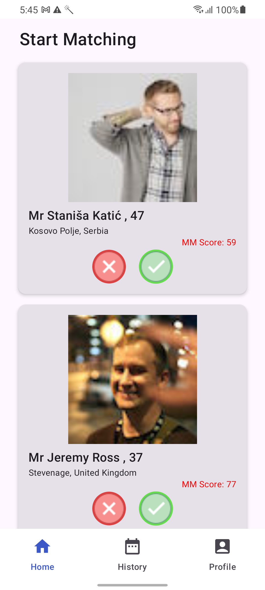
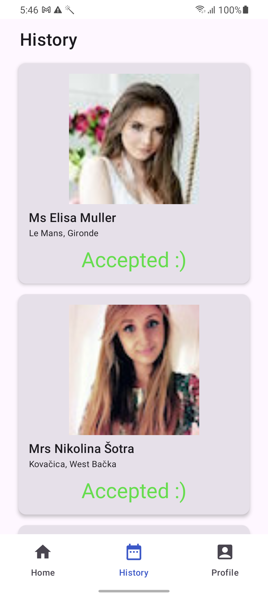
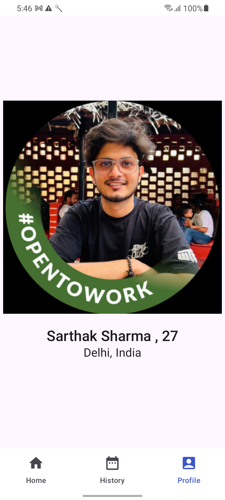

# MatchMate
It is a global dating app, that helps connect people across the globe!

---

## 🧩 Architecture

This project is implemented using **MVVM + Clean Architecture**, dividing the entire app into three modules:

- **App Layer**
- **Domain Layer**
- **Data Layer**

It further uses **interfaces** and **restricted class hierarchies** to achieve abstraction and enforce clean separation between responsibilities.

### ✅ Advantages

Using this architectural approach and modern libraries provides the following benefits:

- 🔄 **Separation of Concerns (SoC)**
- 🧪 **Improved Testability**
- 📈 **Scalability & Maintainability**
- 👥 **Improved Developer Collaboration**
 

## 📘 Libraries:

- 🧱 **Jetpack Compose**  
  Simplifies and accelerates UI development with a modern, declarative approach.

- 🧭 **Compose Navigation**  
  Provides an intuitive and type-safe way to navigate between composables.

- 🗡️ **Dagger-Hilt**  
  Streamlines dependency injection in Android with minimal boilerplate and full lifecycle awareness.

- 🔁 **Kotlin Coroutines**  
  Enables asynchronous and non-blocking programming with a simple, readable syntax.

- 🌊 **Kotlin Flows**  
  Offers a reactive stream API for handling asynchronous data and events.

- 🏠 **Room DB**  
  Provides an abstraction layer over SQLite with compile-time query validation and Kotlin support.

- 🖼️ **Coil**  
  A fast, lightweight image loading library optimized for Jetpack Compose and Kotlin.

- 🌐 **Retrofit**
  Simplifies HTTP networking by turning REST APIs into Kotlin interfaces with ease.

 

## 📷 Screen-shots

                                            

## 📈 MM Score

- We calculate the distance between person's **latitude and longitude** and the matching profile's, based on the distance score updated. This helps in connecting with people who are in close proximity.
- Based on the **age difference**, score is updated if the matching profile is more eligible!
- Combining these scores, gives us the final **MM Score**

---

  
